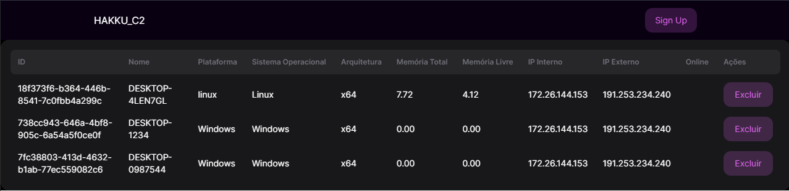

+++

title = "Sistema de Monitoramento de Maquinas - Parte 1"

date = "2023-09-09T12:11:51-03:00"

author = "Jonathan Ponciano"

authorTwitter = "" #do not include @

cover = "../../public/img/cover_hakkuc2.PNG"

tags = ["", ""]

keywords = ["", ""]

description = ""

showFullContent = false

readingTime = false

hideComments = false

color = "blue" #color from the theme settings

+++

## Sistema de Monitoramento de Maquinas - Parte 1



Então vamos lá, estou atualmente testando minhas skill de front-end e back-end neste projeto de sistema de monitoramento de maquinas, que quem sabe se eu tiver tempo mais pra frente eu implemente um C2 de verdade para fazermos comando e controle remoto nas nossas maquinas com os agentes instalados. 

Falando em agents vamos começar com eles, no geral eu criei algo bem simples por enquanto, puxando dados básicos da maquina e fazendo um POST direto no nosso servidor :

``````javascript
agent.js
const axios = require('axios');
const os = require('os');
const getExternalIp = require('external-ip')();

// Função para coletar informações da máquina
async function coletarInformacoesDaMaquina() {
  const dadosMaquina = {
    nome: os.hostname(),
    plataforma: os.platform(),
    sistemaOS: os.type(),
    arquitetura: os.arch(),
    memoriaTotal: os.totalmem(),
    memoriaLivre: os.freemem(),
  };

  // Obtém o IP externo da máquina (requer uma conexão com a internet)
  getExternalIp((err, ip) => {
    if (err) {
      console.error('Erro ao obter o IP externo:', err);
    } else {
      dadosMaquina.ipExterno = ip;
      enviarDadosParaServidorCentral(dadosMaquina);
    }
  });

  // Obtém o IP interno da máquina
  const interfaces = os.networkInterfaces();
  for (const interfaceName of Object.keys(interfaces)) {
    const interface = interfaces[interfaceName];
    for (const addressInfo of interface) {
      if (addressInfo.family === 'IPv4' && !addressInfo.internal) {
        dadosMaquina.ipInterno = addressInfo.address;
        break;
      }
    }
    if (dadosMaquina.ipInterno) {
      break;
    }
  }

  return dadosMaquina;
}

// URL do servidor central
const servidorCentralURL = 'http://localhost:3001/receber-dados';

// Função para enviar os dados ao servidor central
function enviarDadosParaServidorCentral(dadosDaMaquina) {
  axios
    .post(servidorCentralURL, dadosDaMaquina)
    .then((response) => {
      console.log('Dados enviados com sucesso para o servidor central.');
    })
    .catch((error) => {
      console.error('Erro ao enviar dados para o servidor central:', error);
    });
}

// Configurar um temporizador para enviar dados a cada intervalo (por exemplo, a cada 5 segundos)
const intervaloDeEnvio = 5000; // 5 segundos

setInterval(coletarInformacoesDaMaquina, intervaloDeEnvio);

``````

Agora vamos pro nosso servidor, mas de ante mão é bom eu ressaltar que enquanto eu escrevo este post, eu estava testando uma funcionalidade para verificar ultimo intervalo de envio do agent, para gente ter um status, de quais maquinas estão online ou offline. 

Em suma, a gente recebe os dados que foram feito os POST pelo agent, e ajustamos alguns parametros, como memoria RAM, onde ajustamos para ser interpretada como GB, e o salvamento das informações em um JSON, pq eu tava com preguiça de fazer um sqlite ou um postgres pra um projeto pequeno desse.

``````javascript
const express = require('express');
const bodyParser = require('body-parser');
const fs = require('fs');
const { v4: uuidv4 } = require('uuid'); // Importe a função uuidv4 da biblioteca uuid
const cors = require('cors')

const app = express();
const port = 3001;

app.use(bodyParser.json());

app.use(cors())

// Função para converter bytes para gigabytes (GB)
function bytesParaGB(bytes) {
  return (bytes / (1024 ** 3)).toFixed(2); // 1 GB = 1024^3 bytes
}

// Endpoint para receber os dados das máquinas
app.post('/receber-dados', (req, res) => {
  const newData = req.body;
  console.log('Novos dados recebidos:', newData);

  // Ler o arquivo JSON existente (se existir)
  let data = [];
  try {
    const rawData = fs.readFileSync('dados.json');
    data = JSON.parse(rawData);
  } catch (error) {
    // Se o arquivo não existe, apenas continue com um array vazio
  }

  // Verificar se já existe um registro com o mesmo nome (Maquina A, Maquina B)
  const existingDataIndex = data.findIndex((item) => item.nome === newData.nome);

  if (existingDataIndex !== -1) {
    // Atualizar os dados existentes
    const existingData = data[existingDataIndex];
    existingData.plataforma = newData.plataforma;
    existingData.sistemaOS = newData.sistemaOS;
    existingData.arquitetura = newData.arquitetura;
    existingData.memoriaTotal = bytesParaGB(newData.memoriaTotal); // Converter para GB
    existingData.memoriaLivre = bytesParaGB(newData.memoriaLivre); // Converter para GB
    // Adicione os IPs interno e externo ao registro existente
    existingData.ipInterno = newData.ipInterno;
    existingData.ipExterno = newData.ipExterno;
  } else {
    // Adicionar novo registro com um ID único
    const newMachine = {
      id: uuidv4(), // Gere um ID único
      ...newData,
      memoriaTotal: bytesParaGB(newData.memoriaTotal), // Converter para GB
      memoriaLivre: bytesParaGB(newData.memoriaLivre), // Converter para GB
      online: true,
      lastUpdate: new Date(),
    };
    // Adicione os IPs interno e externo ao novo registro
    newMachine.ipInterno = newData.ipInterno;
    newMachine.ipExterno = newData.ipExterno;
    data.push(newMachine);
  }

  // Salvar os dados atualizados no arquivo JSON
  fs.writeFileSync('dados.json', JSON.stringify(data));

  res.send('Dados recebidos com sucesso!');
});

// Função para verificar o status online das máquinas
function verificarStatusOnline() {
  const data = JSON.parse(fs.readFileSync('dados.json'));

  const limiteDeInatividade = 10 * 60 * 1000; // 10 minutos de inatividade

  for (const machine of data) {
    const agora = new Date();
    const tempoDesdeUltimaAtualizacao = agora - new Date(machine.lastUpdate);

    if (tempoDesdeUltimaAtualizacao > limiteDeInatividade) {
      // A máquina está offline
      machine.online = false;
    } else {
      // A máquina está online
      machine.online = true;
    }
  }

  // Salve os dados atualizados
  fs.writeFileSync('dados.json', JSON.stringify(data));
}

// Agende a verificação do status online a cada intervalo (por exemplo, a cada 1 minuto)
const intervaloDeVerificacao = 60 * 1000; // 1 minuto
setInterval(verificarStatusOnline, intervaloDeVerificacao);


// Endpoint para listar todos os dados
app.get('/dados', (req, res) => {
  try {
    const rawData = fs.readFileSync('dados.json');
    const data = JSON.parse(rawData);
    res.json(data);
  } catch (error) {
    res.status(500).send('Erro ao buscar dados.');
  }
});

// Endpoint para listar dados com base em um ID
app.get('/dados/:id', (req, res) => {
  const id = req.params.id;
  try {
    const rawData = fs.readFileSync('dados.json');
    const data = JSON.parse(rawData);
    const matchingData = data.find((item) => item.id === id); // Procura por ID, não mais por nome
    if (matchingData) {
      res.json(matchingData);
    } else {
      res.status(404).send('Dados não encontrados.');
    }
  } catch (error) {
    res.status(500).send('Erro ao buscar dados.');
  }
});

app.listen(port, () => {
  console.log(`Servidor rodando na porta http://localhost:${port}`);
});

``````

Em suma por enquanto é isto, backend está basicamente funcional para nosso objetivo que no proximo post, vai ser criar um front-end descente, mas ai fica no ar, eu sei fazer? Claramente não, mas vou tentar fazer alguma coisa usando NextJS já que no nosso TodoList lá no github, a gente tem pagina de login e auth de usuarios, somado depois com criação de agents, nativos para sistemas operacionais. 

Conhecido também como PS1 que você coloca no AD, e já roda na maquina de todomundo.

